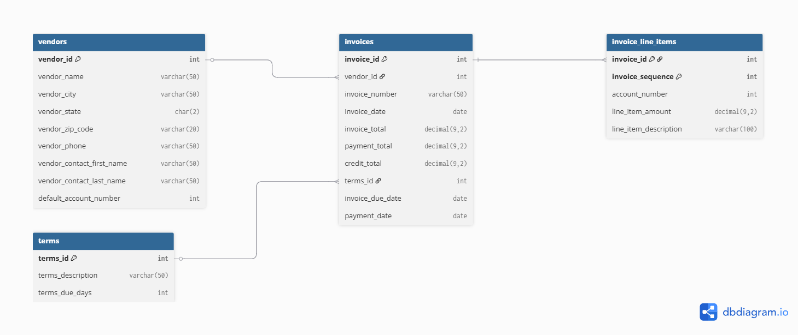

# vendor-invoice-sql-analysis[README.md](https://github.com/user-attachments/files/26522159/README.md)
# SQL Portfolio — Accounts Payable Database Analysis
**Sara Mathews | https://www.linkedin.com/in/sara-mathews-12a577138/ | saraam0314@gmail.com**

---

## Overview
This portfolio demonstrates SQL proficiency through a series of analytical queries written against a relational **Accounts Payable (AP)** database. The database tracks vendor relationships, invoice lifecycles, payment activity, and line-item detail — a common structure in finance and operations environments.

Skills demonstrated include: `SELECT` & filtering, aggregate functions, multi-table JOINs, subqueries, correlated subqueries, views, stored procedures, user-defined functions, and DML (INSERT / UPDATE / DELETE).

---

## Database Schema

> ERD generated via [dbdiagram.io](https://dbdiagram.io)

**Tables:**
- `vendors` — supplier master data (name, location, contact info, default GL account)
- `invoices` — invoice header records (totals, dates, payment status, terms)
- `invoice_line_items` — line-level detail for each invoice (amount, description, GL account)
- `terms` — payment term definitions (e.g. Net 30)

**Key Relationships:**
- One vendor → many invoices
- One invoice → many line items
- One terms record → many invoices

---

## Query Categories

### 1. Filtering, String Functions & Date Logic
📁 `01_filtering_strings_dates/`

| File | Business Question |
|------|-------------------|
| `vendor_locations.sql` | Format and display full vendor location strings |
| `overdue_invoices.sql` | Identify overdue invoices and calculate estimated late fees |
| `vendor_name_length.sql` | Analyze vendor name length (storage optimization exercise) |
| `invoices_by_year.sql` | Count invoices grouped by year to identify volume trends |
| `california_vendors.sql` | Filter vendors operating in California |

---

### 2. Aggregation & GROUP BY
📁 `02_aggregation/`

| File | Business Question |
|------|-------------------|
| `vendors_with_3plus_invoices.sql` | Find high-volume vendors (3+ invoices) to prioritize vendor management |
| `max_invoice_over_500.sql` | Identify vendors with large invoices (>$500) for spend analysis |
| `invoice_totals_by_terms.sql` | Break down invoice volume by payment terms to assess cash flow timing |
| `avg_payment_by_vendor.sql` | Find vendors receiving high average payments (avg > $5,000) |
| `weekly_invoice_averages.sql` | Calculate week-over-week invoice trends |
| `vendors_low_avg_invoice.sql` | Surface vendors with low average invoice totals (<$300) |
| `top_2_credit_vendors.sql` | Identify the two vendors with the highest total credits issued |
| `vendors_5plus_invoices.sql` | Analyze max invoice and average credit for active vendors (5+ invoices) |

---

### 3. Subqueries & Correlated Subqueries
📁 `03_subqueries/`

| File | Business Question |
|------|-------------------|
| `invoices_above_june_avg.sql` | Find June invoices exceeding the monthly average (benchmarking) |
| `repeat_vendors_may.sql` | Identify vendors active in May who also had prior invoice history |
| `invoices_near_vendor_max.sql` | Flag invoices within 80% of each vendor's maximum — high-value outlier detection |
| `invoices_multiple_line_items.sql` | Retrieve all invoices containing more than one line item |

---

### 4. DML — INSERT, UPDATE, DELETE
📁 `04_dml/`

| File | Business Question |
|------|-------------------|
| `insert_test_invoice.sql` | Insert a new invoice and associated line items |
| `update_credit_total.sql` | Apply a 10% credit adjustment to an invoice |
| `delete_invoice.sql` | Remove a test invoice record cleanly |

---

### 5. Views
📁 `05_views/`

| File | Business Question |
|------|-------------------|
| `vendor_invoices_view.sql` | Create a reusable view joining vendor and invoice data for reporting |
| `balance_due_view.sql` | Build a validated view calculating balance due, with CHECK OPTION constraints |

---

### 6. Stored Procedures & Functions
📁 `06_procedures_functions/`

| File | Business Question |
|------|-------------------|
| `vendor_balance_summary_proc.sql` | Procedure: look up a vendor's full payment status and return a call-to-action message |
| `vendor_invoice_count_proc.sql` | Procedure with OUT parameter: return vendor invoice count as a formatted string |
| `initials_function.sql` | Scalar function: extract initials from vendor contact first and last name |
| `phone_format_function.sql` | Scalar function: reformat phone numbers from (XXX) XXX-XXXX to XXX.XXX.XXXX |

---

## How to Run
These queries were written and tested in **MySQL** against the `mgt4250` / `data4250_ap` database.

To run locally:
1. Set up MySQL and import the AP schema
2. Open any `.sql` file in MySQL Workbench or a compatible client
3. Execute against your local instance of the database

---

## Skills Summary

| Category | Skills |
|----------|--------|
| Querying | SELECT, WHERE, ORDER BY, LIMIT, LIKE, CASE WHEN |
| Aggregation | GROUP BY, HAVING, COUNT, SUM, AVG, MIN, MAX |
| Joins | INNER JOIN, multi-table JOIN, USING clause |
| Subqueries | Scalar, correlated, IN / NOT IN |
| DML | INSERT, UPDATE, DELETE, SET SQL_SAFE_UPDATES |
| Objects | CREATE VIEW, WITH CHECK OPTION, CREATE PROCEDURE, CREATE FUNCTION |
| Functions | String (CONCAT, LENGTH, REPLACE, LEFT), Date (YEAR, WEEK, MONTH, CURRENT_DATE), Math (ROUND) |
